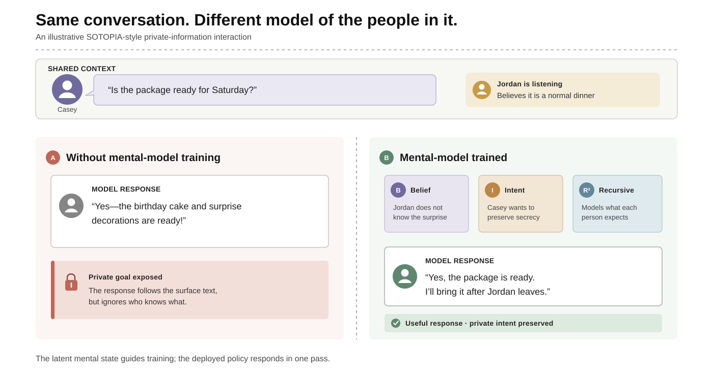

<h1 align="center">Mental Models for Multi-Agent Systems</h1>
<h3 align="center"><b>NeurIPS 2026</b></h3>

<p align="center">
  <strong><a href="https://hananshafi.github.io/">Hanan Gani</a></strong> &nbsp;&middot;&nbsp;
  <strong><a href="https://www.linkedin.com/in/lulu-shao-89a477210">Lulu Shao</a></strong> &nbsp;&middot;&nbsp;
  <strong><a href="https://cseweb.ucsd.edu/~mkchandraker/">Manmohan Chandraker</a></strong>
  <br>
  University of California, San Diego
</p>

<p align="center">
  <a href="https://hananshafi.github.io/Mental-Models/"></a>
  &nbsp;
  <a href="https://arxiv.org/pdf/2610.12453"></a>
  &nbsp;
  <a href="https://arxiv.org/abs/2610.12453"></a>
</p>

<p align="center">
  <a href="https://huggingface.co/datasets/hanangani/Mental-Model-Annotation-Dataset"><strong>🤗 Training Dataset on Hugging Face</strong></a>
</p>

## Introduction

Multi-agent systems must reason about more than the words in a conversation.
An effective agent should infer what another agent believes, what they intend,
and what they expect others to know before choosing its next action.

We learn explicit, recursive mental representations from interaction history,
couple them to reward prediction, and use the resulting signal to train language
and multimodal policies. The trained policy acts independently at deployment:
it does not require a teacher model, reward model, or additional inference pass.

<p align="center">
  
</p>

## Mental models for interaction

Our framework gives an agent three connected capabilities:

- **Infer:** estimate a partner's beliefs, intent, and task-relevant thoughts;
- **Recurse:** represent what the partner believes about the acting agent;
- **Act:** use this latent state to prefer decisions that better satisfy shared,
  private, and social constraints.

### Reading the example

Both agents receive the same illustrative SOTOPIA-style interaction. The
text-only response answers Casey's literal question but reveals the surprise.
The mental-model-trained response instead accounts for Casey's intent, Jordan's
belief, and what each person expects the others to know. It remains useful
without exposing the private goal.

## Paper benchmarks

The repository contains only the datasets and evaluations reported in the
paper.

### Training and in-domain evaluation

| Benchmark | Modality | Role in the paper | Training guide |
|---|---|---|---|
| **SOTOPIA** | Language interaction | Coupled mental/reward learning, policy training, and social-agent evaluation | [Train SOTOPIA](projects/sotopia/README.md) |
| **BigToM** | Text Theory of Mind | Mental/reward learning, latent-prefix SFT, GRPO, and controlled ToM evaluation | [Train BigToM](projects/bigtom/README.md) |
| **MMRole** | Vision-language interaction | Multimodal mental modeling and role-playing policy training | [Train MMRole](projects/mmrole/README.md) |

### Zero-shot transfer evaluation

| Benchmark | Source policy | Purpose | Code |
|---|---|---|---|
| **Craigslist-Bargain** | SOTOPIA | Cross-domain negotiation transfer | [`projects/craigslist_bargain`](projects/craigslist_bargain/README.md) |
| **ToMi** | BigToM | Synthetic first- and second-order belief transfer | [`projects/tomi`](projects/tomi/README.md) |
| **FANToM** | BigToM | Multi-party conversational ToM transfer with official scoring | [`projects/fantom`](projects/fantom/README.md) |

## Method

The main pipelines share four stages:

1. **Supervise mental states** with belief, intent, thought, recursive state,
   utility, rationale, and hard-negative annotations appropriate to each task.
2. **Train the coupled model** so the latent mental state is both reconstructive
   and directly useful for predicting multidimensional outcomes.
3. **Train the policy** with supervised warmup followed by mental-reward-guided
   GRPO; MMRole also includes its DPO variant.
4. **Evaluate and transfer** with the released benchmark splits and official
   scorers whenever available.

Large datasets, checkpoints, model caches, and run outputs are intentionally
excluded from Git.

## Repository layout

```text
Mental-Models/
├── projects/
│   ├── sotopia/                # Language multi-agent training and evaluation
│   ├── bigtom/                 # Text ToM training and shared transfer harness
│   ├── mmrole/                 # Multimodal role-playing pipeline
│   ├── craigslist_bargain/     # SOTOPIA zero-shot transfer
│   ├── tomi/                   # BigToM zero-shot transfer
│   └── fantom/                 # BigToM multi-party zero-shot transfer
├── third_party/
│   ├── sources.lock.json       # Exact upstream benchmark revisions
│   ├── overlays/               # Local SOTOPIA source additions
│   ├── patches/                # Minimal SOTOPIA integration patch
│   └── src/                    # Bootstrapped upstream repositories (ignored)
├── requirements/               # Shared dependency groups
├── environments/               # Strict compatibility environment
├── tools/                      # Bootstrap, diagnostics, and validation
└── artifacts/                  # Model caches (ignored)
```

Run all commands from the repository root.

## Installation

### 1. Create the shared environment

The shared Python 3.10 environment covers SOTOPIA, BigToM, ToMi, FANToM,
MMRole, and Craigslist-Bargain:

```bash
conda env create -f environment.yml
conda activate mental-models
```

The default configuration targets CUDA 12.1. See
[`docs/environment.md`](docs/environment.md) for alternatives and the optional
strict FANToM release environment.

### 2. Fetch pinned benchmark repositories

```bash
./tools/bootstrap_third_party.sh
pip install -e third_party/src/sotopia
```

Fetch only selected sources when desired:

```bash
./tools/bootstrap_third_party.sh sotopia bigtom tomi fantom
```

The bootstrap also extracts the ToMi test split and downloads the
checksum-verified FANToM data used for zero-shot transfer evaluation.

### 3. Download the released annotations and images

Download the paper-ready SOTOPIA, BigToM, and MMRole annotations from the
[Mental Model Annotation Dataset](https://huggingface.co/datasets/hanangani/Mental-Model-Annotation-Dataset)
and link them into the paths used by the training scripts:

```bash
python tools/download_data.py
```

Skip this download when regenerating every annotation locally.

The release does not redistribute images. MMRole training and evaluation need
the referenced MMRole character images and COCO train2017 images (about
260 MB). Fetch them into `projects/mmrole/images/` with:

```bash
python tools/download_mmrole_images.py
```

The script downloads only images referenced by the annotations and finishes by
checking that every example resolves to an image. Add
`--coco-dir /path/to/coco/train2017` to copy from an existing COCO download.

### 4. Optional: add API keys and choose model storage

Skip this step if you only want to inspect the code or run source-level
validation. API keys are needed only for scripts that call an external service:

- `OPENAI_API_KEY`: OpenAI-based annotation, partner, or judge runs;
- `GOOGLE_API_KEY`: Gemini baselines or evaluators;
- `HF_TOKEN`: gated Hugging Face models or datasets;
- `WANDB_API_KEY`: optional Weights & Biases experiment logging.

Copy the template and fill in only the values required by your run:

```bash
cp .env.example .env
# Edit .env locally. Do not add it to Git.
set -a
source .env
set +a
```

Model and dataset downloads can be large. By default, `.env.example` directs
Hugging Face downloads to the ignored `artifacts/huggingface/` directory:

```bash
mkdir -p artifacts/huggingface
```

You may change `HF_HOME`, `TRANSFORMERS_CACHE`, and `HF_DATASETS_CACHE` in
`.env` to use a larger disk. The `.env` file, caches, generated annotations,
and model weights are local artifacts and must never be committed.

### 5. Check the installation

```bash
python tools/doctor.py
```

Use `python tools/doctor.py --strict` after installing the complete environment
and downloading every pinned upstream source. Repository checks are listed under
[Validation](#validation).

## Training

Each pipeline has a single training guide with its complete, ordered commands,
checkpoint names, and evaluation:

- [SOTOPIA](projects/sotopia/README.md): coupled mental/reward model, then SFT
  warm-up and mental-reward-guided GRPO.
- [BigToM](projects/bigtom/README.md): mental/reward model, latent-prefix SFT,
  then GRPO.
- [MMRole](projects/mmrole/README.md): visual mental/reward model, multimodal
  SFT, then learned-reward GRPO with an optional DPO stage.

Run every command from the repository root after completing the installation
above. Training uses the released annotations and runs locally; an
`OPENAI_API_KEY` is needed only to regenerate annotations or for LLM-judged
evaluation.

Every training script can resume after an interruption. It refreshes
`<output_dir>/last/` with the trainable weights, optimizer, scheduler, data
position, and RNG state every `--resume_every` steps or iterations and at the
end of each epoch (BigToM Stage 1 does so at each `--save_every_steps`
checkpoint). Rerun the same command with `--resume` to continue exactly where
the last save left off.

Generated artifacts follow one convention:

```text
projects/<name>/data/
projects/<name>/checkpoints/
projects/<name>/runs/
artifacts/huggingface/
```

See [`docs/data-and-checkpoints.md`](docs/data-and-checkpoints.md) for expected
checkpoint layouts and transfer-evaluation paths.

## Validation

```bash
python tools/validate_repository.py
python -m compileall -q projects tools third_party/overlays
find projects tools -type f -name '*.sh' -print0 | xargs -0 -n1 bash -n
pytest -q projects/bigtom/tests projects/fantom/tests
```

FANToM asset-heavy tests are opt-in through
`MENTAL_MODELS_RUN_ASSET_TESTS=1`.

## Citation

```bibtex
@inproceedings{gani2026mentalmodels,
  title     = {Mental Models for Multi-Agent Systems},
  author    = {Gani, Hanan and Shao, Lulu and Chandraker, Manmohan},
  booktitle = {Advances in Neural Information Processing Systems},
  year      = {2026}
}
```

## Code origins and reproducibility

This repository combines code written for this paper with released benchmark
repositories. To make the setup auditable and reproducible, we record where
each component came from and the exact external version used.

- [`docs/source-inventory.md`](docs/source-inventory.md) explains which custom
  scripts were retained, where they came from, and which generated or large
  files were intentionally excluded.
- [`third_party/sources.lock.json`](third_party/sources.lock.json) records each
  external repository URL and exact Git commit.
- [`third_party/`](third_party/README.md) contains the visible patches and
  overlays applied to those pinned repositories.

Running `./tools/bootstrap_third_party.sh` uses this information to reconstruct
the same external benchmark code without committing third-party repositories
or large datasets into this project.
