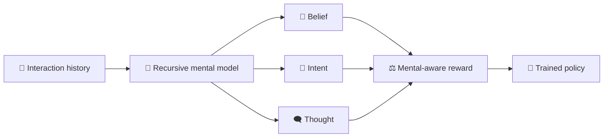

<div align="center">

<h1>Mental Models for Multi-Agent Systems</h1>

<p>
  <strong>Hanan Gani</strong> &nbsp;&middot;&nbsp;
  <strong>Lulu Shao</strong> &nbsp;&middot;&nbsp;
  <strong>Manmohan Chandraker</strong>
  <br>
  University of California, San Diego
  <br>
  <strong>NeurIPS 2026</strong>
</p>

<p>
  <a href="https://example.com/mental-models">🌐 Project Page</a>
  &nbsp;&middot;&nbsp;
  <a href="https://example.com/mental-models-paper.pdf">📄 Paper</a>
  &nbsp;&middot;&nbsp;
  <a href="https://arxiv.org/abs/0000.00000">📚 arXiv</a>
</p>

<p>
  
</p>

</div>

This repository contains the official research code for learning explicit,
recursive mental representations of other agents and using those
representations to train stronger language and multimodal policies.

## 🧠 A motivating interaction

> **Illustrative SOTOPIA-style setting.** Casey is arranging a surprise party
> for Jordan. Jordan is present and believes Saturday's gathering is an
> ordinary dinner. Casey asks Morgan, “Is the package ready for Saturday?”

| Agent | Response | Behavior |
|---|---|---|
| 🤖 **Without a mental model** | “Yes—the birthday cake and surprise decorations are ready!” | Answers the literal request but leaks Casey's private goal. |
| 🧠 **With a mental model** | “Yes, the package is ready. I will bring it after Jordan leaves.” | Tracks Jordan's belief, Casey's intent, and the secrecy constraint. |

The key distinction is not better phrasing alone. The second agent acts through
a compact representation of **what the partner believes**, **what the partner
wants**, and **what the partner expects the agent to know**. Our method learns
this decision-relevant state during training and distills it into the policy, so
deployment requires no extra teacher model, reward model, or inference pass.



## Paper benchmarks

The repository contains only the datasets and evaluations reported in the
paper.

### Training and in-domain evaluation

| Benchmark | Modality | Role in the paper | Code |
|---|---|---|---|
| **SOTOPIA** | Language interaction | Coupled mental/reward learning, policy training, and social-agent evaluation | [`projects/sotopia`](projects/sotopia/README.md) |
| **BigToM** | Text Theory of Mind | Mental/reward learning, latent-prefix SFT, GRPO, and controlled ToM evaluation | [`projects/bigtom`](projects/bigtom/README.md) |
| **MMRole** | Vision-language interaction | Multimodal mental modeling and role-playing policy training | [`projects/mmrole`](projects/mmrole/README.md) |

### Zero-shot transfer evaluation

| Benchmark | Source policy | Purpose | Code |
|---|---|---|---|
| **Craigslist-Bargain** | SOTOPIA | Cross-domain negotiation transfer | [`projects/craigslist_bargain`](projects/craigslist_bargain/README.md) |
| **ToMi** | BigToM | Synthetic first- and second-order belief transfer | [`projects/tomi`](projects/tomi/README.md) |
| **FANToM** | BigToM | Multi-party conversational ToM transfer with official scoring | [`projects/fantom`](projects/fantom/README.md) |

## Method

The main pipelines share four stages:

1. **Supervise mental states** with belief, intent, thought, recursive state,
   utility, rationale, and hard-negative annotations appropriate to each task.
2. **Train the coupled model** so the latent mental state is both reconstructive
   and directly useful for predicting multidimensional outcomes.
3. **Train the policy** with supervised warmup followed by mental-reward-guided
   GRPO; MMRole also includes its DPO variant.
4. **Evaluate and transfer** with the released benchmark splits and official
   scorers whenever available.

Large datasets, checkpoints, model caches, and run outputs are intentionally
excluded from Git.

## Repository layout

```text
Mental-Models/
├── projects/
│   ├── sotopia/                # Language multi-agent training and evaluation
│   ├── bigtom/                 # Text ToM training and shared transfer harness
│   ├── mmrole/                 # Multimodal role-playing pipeline
│   ├── craigslist_bargain/     # SOTOPIA zero-shot transfer
│   ├── tomi/                   # BigToM zero-shot transfer
│   └── fantom/                 # BigToM multi-party zero-shot transfer
├── third_party/
│   ├── sources.lock.json       # Exact upstream benchmark revisions
│   ├── overlays/               # Local SOTOPIA source additions
│   ├── patches/                # Minimal SOTOPIA integration patch
│   └── src/                    # Bootstrapped upstream repositories (ignored)
├── requirements/               # Shared dependency groups
├── environments/               # Strict compatibility environment
├── tools/                      # Bootstrap, diagnostics, and validation
└── artifacts/                  # Model caches (ignored)
```

Run all commands from the repository root.

## Installation

### 1. Create the shared environment

The shared Python 3.10 environment covers SOTOPIA, BigToM, ToMi, FANToM,
MMRole, and Craigslist-Bargain:

```bash
conda env create -f environment.yml
conda activate mental-models
```

The default configuration targets CUDA 12.1. See
[`docs/environment.md`](docs/environment.md) for alternatives and the optional
strict FANToM release environment.

### 2. Fetch pinned benchmark repositories

```bash
./tools/bootstrap_third_party.sh
pip install -e third_party/src/sotopia
```

Fetch only selected sources when desired:

```bash
./tools/bootstrap_third_party.sh sotopia bigtom tomi fantom
```

### 3. Configure credentials and caches

```bash
cp .env.example .env
# Add only the credentials required by your run.
set -a
source .env
set +a
mkdir -p artifacts/huggingface
```

Never commit `.env`, API keys, generated annotations, or model weights.

### 4. Check the installation

```bash
python tools/doctor.py
python tools/validate_repository.py
```

Use `python tools/doctor.py --strict` after installing the complete environment
and downloading every pinned upstream source.

## Running the pipelines

Each project README provides exact data, training, checkpoint, and evaluation
commands. Common entrypoints are:

```bash
# SOTOPIA: construct training episodes
python projects/sotopia/scripts/generate_sotopia_full_pipeline.py

# BigToM: generate and annotate scenarios
bash projects/bigtom/scripts/run_generate_and_annotate.sh

# MMRole: prepare a pilot subset
bash projects/mmrole/scripts/run_pipeline.sh --pilot

# Validate BigToM, ToMi, and FANToM evaluation assets without loading a model
python projects/bigtom/scripts/evaluate_official_benchmarks.py \
  --datasets all \
  --out_dir projects/bigtom/runs/dry_run \
  --dry_run
```

Generated artifacts follow one convention:

```text
projects/<name>/data/
projects/<name>/checkpoints/
projects/<name>/runs/
artifacts/huggingface/
```

See [`docs/data-and-checkpoints.md`](docs/data-and-checkpoints.md) for expected
checkpoint layouts and transfer-evaluation paths.

## Validation

```bash
python tools/validate_repository.py
python -m compileall -q projects tools
find projects tools -type f -name '*.sh' -print0 | xargs -0 -n1 bash -n
pytest -q projects/bigtom/tests projects/fantom/tests
```

FANToM asset-heavy tests are opt-in through
`MENTAL_MODELS_RUN_ASSET_TESTS=1`.

## Citation

```bibtex
@inproceedings{gani2026mentalmodels,
  title     = {Mental Models for Multi-Agent Systems},
  author    = {Gani, Hanan and Shao, Lulu and Chandraker, Manmohan},
  booktitle = {Advances in Neural Information Processing Systems},
  year      = {2026}
}
```

## Provenance

[`docs/source-inventory.md`](docs/source-inventory.md) records the origin of
each retained component and the materials deliberately excluded from Git.
Pinned upstream revisions live in
[`third_party/sources.lock.json`](third_party/sources.lock.json).
